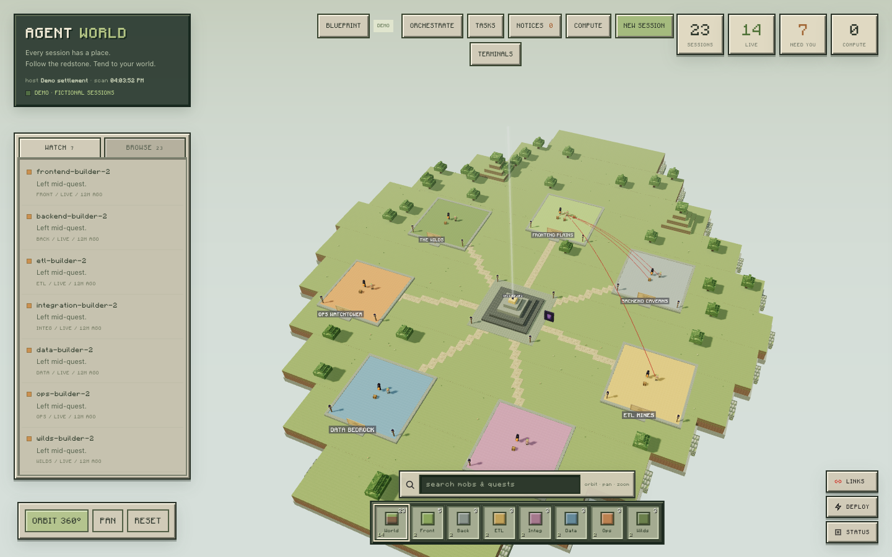
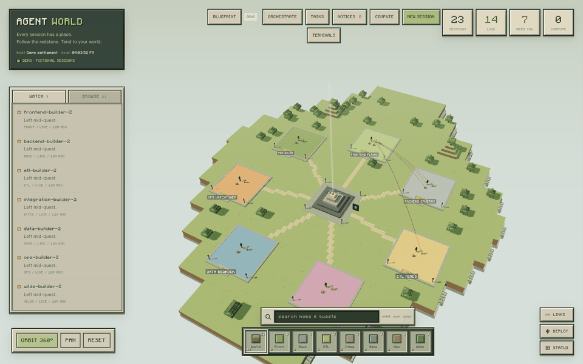
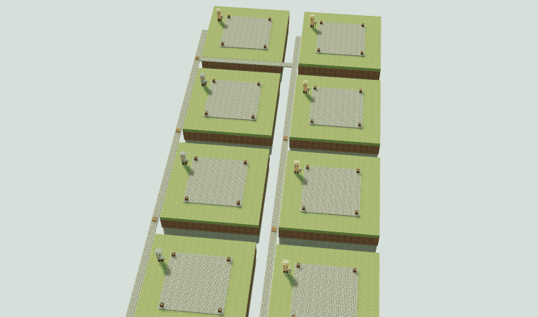
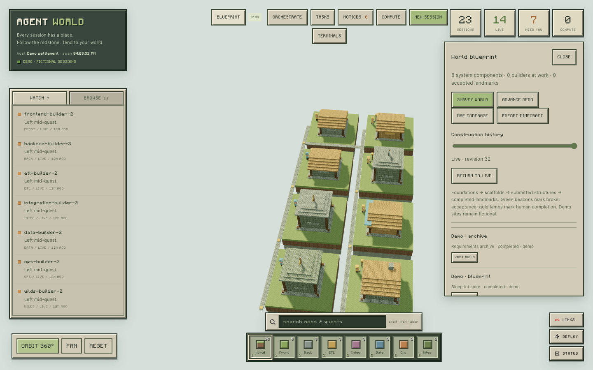

# Agent World

**Give your coding agents a world to build.**

Agent World turns Claude Code and Codex sessions into villagers in a Minecraft-inspired
voxel settlement. Follow redstone trails between agents, spot Endermen when a decision
needs you, and watch tasks grow from foundations into workshops. Completed work leaves
a lasting mark on the map.



*The demo world uses fictional sessions and tasks.*

Explore the settlement, inspect a villager, and open its terminal without leaving the
world. The task board tracks each build; the blueprint district records its history and
can export the displayed revision as a Minecraft Java schematic. For larger projects,
the local control room coordinates Claude and Codex workers, tests, reviews, and gates
before a build is accepted.

| Explore the agent world | Watch a build take shape |
| --- | --- |
|  |  |



Agent World runs locally as a standalone app with a companion Claude Code plugin. The
demo needs no signed-in coding CLI; real sessions use your installed Claude Code or
Codex CLI. No cloud account or session data in this repository is required.

## Run from source

Requires Node 22+, npm, and an installed, signed-in Claude Code and/or Codex CLI for real sessions.
The embedded terminal uses node-pty; its native build may require the platform's C++ tools.

```sh
npm install
npm run demo -- --open
# Real local sessions (run separately after stopping demo):
npm start -- --open
```

Open the authenticated URL printed by the launcher. The token stays in the URL fragment,
then browser session storage. The server listens only on 127.0.0.1.

`--port`, `--state-dir`, and `--claude-dir` are configurable. Nothing assumes a particular
username, project checkout, session ID or neighboring repository. `--demo` uses fictional
data and its own temporary state directory; it never launches Claude or reads ~/.claude.
This package has not been published to npm or GitHub yet.

## Working in the world

- Inspect a mob, then open its terminal in the app. App-owned terminals reconnect in place.
- Attach an existing tmux session, resume an offline session, or explicitly fork a live
  foreground conversation. A foreground terminal outside tmux cannot be silently adopted.
- New Session starts Claude in a directory you choose, using your normal permissions.
- New Session can also start Codex, with an explicit provider, model, effort, sandbox, and normal
  approval policy. Model names are editable because actual availability depends on your account
  and installed CLI; the suggestions are not a capability claim.
- The task board supports planned, building, blocked and completed milestones. Claude's
  successful TaskCreate/TaskUpdate calls also update it through the companion plugin.
- Foundations become scaffolds and then workshops. Completed tasks add floors; buildings
  persist across restarts and remain after the original session disappears. Each builder's
  workshop summarizes its task history; it is not a percentage-of-code-complete estimate.
- Notifications arrive through a live event stream. Browser notifications are opt-in.
- Closing the terminal panel only hides it. Stopping a terminal explicitly ends the app's
  process (or detaches the tmux client). Stopping the server ends its remaining terminals.

The original BROWSE/WATCH, search, hotbar, drawer, redstone graph, and context inventory
remain available. Context can be sent only to a terminal explicitly opened in this app.

## Mixed-model SDLC orchestration

Open **ORCHESTRATE** to create a run. The default roster has two orchestrators, separate
requirements and architecture workers, Claude and Codex developers, independent validation,
and five council lenses: assumptions, completeness, data truth, silent failure, and spec
fidelity. Every row has its own provider, model, effort, role, attempt count, and launch action.
**Launch ready wave** starts only the assignments whose dependencies are satisfied.

Workers share a small provider-neutral MCP surface:

- `world_get_work` reads the immutable assignment and policy.
- `world_inbox` reads durable broker messages.
- `world_send_message` sends an idempotent message only inside the same run.
- `world_submit` records claims and broker-computed SHA-256 hashes for files inside the run root.
- `world_review` records an independent pass, challenge, or human escalation.

Claude-to-Claude native `ListAgents`/`SendMessage` remains available under Claude's own inbound
controls. Agent World does not write undocumented peer sockets or collect peer tokens. Claude ↔
Codex communication uses the scoped broker and wakes the target managed terminal; the full message
is recovered from its MCP inbox. Messages cannot approve permissions, change policy, publish, or
execute commands merely because their text asks for it.

An implementer can only submit a claim. Acceptance is computed by the server and requires a
different-model tester pass, a different-model reviewer pass, a user-confirmed deterministic gate,
all five council lenses, and no challenge or escalation. Audit events are hash-chained, raw worker
credentials are never projected to the browser, and the hook credential cannot administer the app.
After three failed attempts, the run requires human direction.

This is resistance to reward hacking, not a mathematical guarantee that a model cannot deceive.
The remaining hardening frontier is OS/container or managed-worktree isolation for simultaneous
writers. In v0.2, providers request role-appropriate CLI permissions (Codex read-only vs
workspace-write; Claude plan vs acceptEdits) and evidence is confined to the selected root, but
the app does not create or enforce isolated worktrees. Arrange non-overlapping worktrees/directories
outside the app before launching parallel writers, or run writers sequentially. Publishing,
destructive actions, secrets, permission widening, and evaluation changes always stay human-gated.

## Achievement world

Open **BLUEPRINT** to visit the construction district. Each recorded task and orchestration
assignment owns a stable plot, including assignments that have not launched yet. Choose a
component type and dependency when creating a task: interface halls, service forges, data
vaults, pipeline mills, test chambers, archives, observatories, council sanctuaries and command
citadels have distinct recipes. Builders walk their sites and work their tools; new masonry
appears in a bounded animation. Dependency causeways connect the plots.

Click a structure or **VISIT BUILD** for artifact hashes, verdicts, dependency navigation and
recorded milestones. Evidence chests and review lamps encode bounded counts, not guessed
percentages. Green acceptance lights require the orchestration broker's passed run. Manually
completed tasks use gold lights; demo completion is explicitly fictional.

The history slider reconstructs any recorded revision. **RETURN TO LIVE** catches up with new
events received during replay. Existing tasks are imported at first observation; history before
installation is not invented. `achievements.json` stores semantic deltas with a verified hash
chain and atomic replacement. The version-1 world compiler is independent of Three.js and
rebuilds the same plan after a restart. A hash chain detects accidental edits, but is not an
external attestation against a process that can rewrite the entire ledger.

In demo mode, use **ADVANCE DEMO** four times to watch a fictional eight-component system grow
from foundations to scaffolds, submission and completion. This does not launch model sessions.
Replay covers the construction district; the session list and terminal controls continue to
show live state.

## Codebase mapping

Choose **BLUEPRINT → MAP CODEBASE**, enter a project directory, and scan once or enable a
30-second watcher. Components come from source-directory boundaries (including feature,
module, app and package folders). Naming/extension rules infer interface, service, database,
pipeline and test roles. Inspection shows the rule, source paths and hashes. Mapped buildings
represent observed code existence and have no fabricated worker or acceptance beacon.

Relative static JS/TS imports become dependency roads, including common `.js`→`.ts` imports.
Other source languages are grouped by directory/extension only. Aliases, dynamic imports,
runtime calls, generated bindings and external packages are not resolved. Import extraction
is lexical, not a typechecker; classifications and links are explicitly heuristic. This is
an initial architecture map, not proof of runtime topology or code quality.

Scanning never executes project code. Hidden directories, symlinks, common dependency/build
directories and secret-named files are excluded. It does not interpret `.gitignore`; source
files elsewhere under the selected root may be included. Limits are 4,000 source files,
20,000 directory entries, 256 KiB per file, 16 MiB total and 256 components. Partial scans report
coverage and do not retire missing components. A complete rescan retires removed components
while preserving their plot and history; reappearance reuses that plot. Watch registrations
persist in `codebase-projects.json` and can be stopped in the blueprint panel.

## Minecraft Java export

**EXPORT MINECRAFT** downloads the displayed revision (including replay) as gzip-compressed
Sponge v3 `.schem`, using vanilla Java 1.20.1 block states/DataVersion 3465. Structures and
dependency roads use the same blueprint geometry as the browser. Fractional pieces are
rounded to full blocks, later pieces overwrite overlaps, and the minimum corner is rebased
to offset `[0,0,0]`. The palette has no command blocks or active redstone; live agent entities,
source contents, absolute paths, session data and evidence details are not exported.

With a compatible WorldEdit installation, copy the download to
`plugins/WorldEdit/schematics/` (Paper/Bukkit) or `config/worldedit/schematics/` (mod).
For a download named `agent-world-r12.schem`:

```text
//schem load agent-world-r12
//paste -n
//paste -a
```

`//paste -n` previews the selection without placing blocks. Choose an empty build area:
`//paste -a` skips air but replaces existing blocks where the export is solid. The app only
downloads the file; it does not connect to or change a server. The export is capped at
4 million voxels. Very large settlements need a smaller revision. Schematics are validated
by decoding their NBT structure and checking palette, dimensions, block data and revision;
an actual in-game import has not been exercised in this development environment.

References: [Sponge v3 specification](https://github.com/SpongePowered/Schematic-Specification/blob/master/versions/schematic-3.md),
[WorldEdit clipboard and schematic instructions](https://worldedit.enginehub.org/en/latest/usage/clipboard/).

## Companion plugin

Sessions launched by the app load `plugin/` automatically. To opt an independently launched
session in, start it yourself with:

```sh
claude --plugin-dir /absolute/path/to/agent-world-app/plugin
```

No user settings are edited automatically. Existing sessions continue to be discovered
without the plugin; hooks add immediate notifications and explicit task milestones.
The hook is silent and fails open when the app is unavailable. It forwards selected event
metadata, task titles, cwd and notification messages; it does not forward prompt contents,
source files or full tool output. These selected fields can still contain private context.

A successful Claude TaskUpdate now records only a worker completion claim. It does not complete
an orchestration assignment. A Stop hook and pre-completion hook likewise never imply acceptance.

## Data and architecture

`src/` contains the local server, provider adapters, PTY bridge, orchestration ledger, trusted
gate runner, world adapter and durable milestone store.
`public/` contains the Three.js r128 world and terminal/task/notification UI. `plugin/` is
self-contained. `vendor/cc-topology/` is the MIT-licensed, read-only graph extractor.

Runtime data defaults to `~/.local/state/agent-world/` and stays outside the package.
The milestone store uses atomic replacement. Each event ID is applied once. SSE reconnects
receive the current state. The terminal bridge caps buffers and checks request origin and
the launch token. It is a local single-user app, not a remotely exposed service.

World scanning caches unchanged transcripts. Status classification and inferred peer edges
remain heuristics. The topology parser depends on Claude's on-disk formats and should be
tested against new CLI releases. Cloud/remote sessions are not controllable in this version.

## Development

### Paired worktree pilot (v0.6)

Use **ORCHESTRATE → + PAIRED RUN** for the isolated workflow. Each run has one Codex
frontend developer, one Claude backend developer, a user-selected model roster, and up
to thirty-two pre-approved assignments. Multiple runs can operate concurrently. Lead
orchestrators can use `world_dispatch` to launch their own ready children and
`world_integrate` to combine submissions. They cannot add arbitrary workers, change
models/scopes, approve contracts, run arbitrary gates, publish, or merge your checkout.

The lifecycle is: proposal → user approval/provisioning → ready/running → both submitted
→ integration → deterministic gates → independent tester/reviewer → five-lens council
→ passed. Failures are visible as provision-failed, ownership-violation,
integration-conflict, gate-failed, challenged, interrupted or needs-human. Rework invalidates
the integration and requires new gates and reviews. Restart revokes old worker credentials;
use RECOVER after inspecting retained worktrees. Exhausted attempts and provisioning errors
require a new approved continuation run. Nothing is auto-merged or published.

Approval freezes endpoint definitions, acceptance criteria, directory ownership, gate argv,
protected evaluation paths and the roster. New proposals default to **fetching origin/develop**,
then pin its commit for all three worktrees. Failed fetches stop; there is no stale fallback.
Base branch, remote and refresh policy appear in the approval dialog. Existing v0.5 proposals
without an explicit base retain their old HEAD behavior: create a new proposal for fresh develop.
Offline fixtures explicitly use local develop without fetch. Dirty or untracked source changes
are never copied. The source checkout is left unchanged, but Git registers
detached worktrees in its repository metadata. Worktrees and captured blobs live in the
app state directory and are retained for inspection; no automatic pruning is performed.
Baseline symlinks/submodules are unsupported. Submissions are capped at 400 changed files
and 8 MB. Shared files, protected tests and package manifests remain human-owned.

Developer submissions capture all nonignored changed files, including deletions; source
paths cannot escape their assigned directories. App-owned paired workers stop after
submission/finished review. Integration uses captured content, not later developer edits.
Gates and reviews bind to exact submission snapshots, contract and integration hashes.
Reviewers must name the current `integrationId` and use a different model than each target.
The world builds an interface site for frontend work and a service site for backend work;
run-state transitions appear in Notices.

Run the offline regression and prepare a separate model-trial project:

```sh
cd ~/agent-world-app
npm run test:paired
npm run setup:paired
```

Setup prints an isolated launcher command with `--paired-config`, a temporary project and
state directory. Open its authenticated URL to see the imported proposal. Review the
model names/efforts for your installed CLIs and subscription, approve, then explicitly
launch orchestrators. Launching uses real models and may incur charges. Subsequent restarts
should omit `--paired-config` to avoid importing another proposal. The fixture's baseline
acceptance suite intentionally fails until both implementations are provided.

**Verification boundary:** automated tests exercise real Git worktrees, actual HTTP
frontend/backend acceptance tests, gate failure/recovery, snapshots, broker routes and
simulated worker credentials/verdicts. Browser smoke tests exercise the visible controls.
They do not validate real Claude/Codex model behavior or CLI authentication. A paid live-model
pilot remains required before unattended use. This is a bounded roster, not arbitrary
recursive spawning or automatic task decomposition; orchestration details can extend it.

**Security boundary:** worktrees and CLI permission modes are not OS isolation. A hostile
same-user process can access other files or credentials. Gate commands execute locally;
approve only trusted repositories and harnesses, keeping the acceptance harness outside
owned implementation paths. Hashes detect changes, not malicious intent. Independent models
and protected test inputs reduce easy reward hacking, but cannot make it impossible.
Untrusted-code execution needs disposable containers/VMs and a separate evaluator identity.

### Docker integration testing

After both developer submissions are integrated, choose **PREPARE DOCKER STACK**. This exports
sanitized build contexts for that exact revision; it does not start services. The generated
directory contains Compose JSON, an integrity manifest, instructions, and runnable commands
in the control-room dialog. Start with the displayed `up` command, find the frontend URL with
`port`, inspect with `logs`, and stop only that project's containers/network with `down`.

The app profile builds frontend + API + private Redis from the combined integration, never
one developer's incomplete worktree. Unique project names, dynamic loopback frontend ports,
private API/Redis ports and `API_PROXY_TARGET=http://api:3001` keep parallel trials separate.
No fixed container names, source mounts, Docker socket, or existing env file is used.
Source export preserves tests/public assets excluded by the stock ignore files and omits
common credential paths. Create `frontend.test.env` and `backend.test.env` only with approved
test settings; they sit outside build context. Missing env files fail startup deliberately.
The backend needs a dedicated test database with the real required schema and whatever
test credentials your own stack declares. Health checks alone do not prove an authenticated
workspace endpoint works. (The built-in `app` profile assumes a `frontend/` + `backend/`
layout; a fully user-defined stack descriptor is on the roadmap — see below.)

```sh
npm run test:paired    # fresh-base, ownership, lifecycle, export regression tests
npm run test:docker    # actual credential-free Docker services + positive/negative HTTP tests
```

The Docker smoke uses deterministic worker submissions, not paid model calls. It requires a
running Docker engine, may pull Node 22 Alpine, and tears down only its unique test project.
Generated images/build cache remain. A failed/unavailable Docker command is a test failure,
never a skip. The report records the tested integration, source commit and runtime image names.
Export preparation and manual Docker runs do not themselves mark an orchestration accepted;
the approved gates and model reviews remain separate requirements.

To verify a real repository without running models:

```sh
node scripts/check-develop.mjs /absolute/path/to/your-repo
```

This fetches origin/develop, creates three detached verification worktrees and checks identical
SHAs/clean status while preserving the original checkout. It prints a JSON report with paths.
These are retained inspection worktrees, not active orchestrator sessions.

Docker references: [Compose project isolation](https://docs.docker.com/compose/how-tos/project-name/),
[build-context and ignore behavior](https://docs.docker.com/build/concepts/context/).

```sh
npm test
npm pack --dry-run
```

Tests use temporary fixtures, fake Claude/Codex launchers, a real stdio MCP exchange, and a short
native shell I/O test, never your sessions. On macOS, the terminal adapter restores the owner execute bit
on node-pty 1.1.0's bundled helper when necessary ([upstream packaging issue](https://github.com/microsoft/node-pty/issues/850)). Demo is the
shareable review surface. Do not commit generated snapshots, transcripts or runtime state.

## Replacing an orchestrator

The control room's **HANDOFF** action is available for approved, integrated paired runs.
It requires both developers to have submitted, no other active workers, a quiescent run,
and an unmodified integration tree. Choose the replacement provider/model/effort and
explicitly approve. Use **LAUNCH** separately to start the replacement; a failed launch
can be retried within the existing attempt budget.

The human-authenticated `POST /api/orchestrations/:id/handoff` endpoint requires
`confirm: true`, `assignmentId`, the current `workerId` (which can be null after exit),
`approvalHash`, `integrationId`, `provider`, `model`, and `effort`. Worker credentials
cannot call this endpoint. Stale context and permission/role changes are rejected.

Handoff revokes the old worker, closes its managed terminal, and records an approval
amendment in the audit chain. Developer submissions, worktrees, ownership, endpoint
contracts, protected tests and source bytes remain unchanged. The amended roster gets
a new approval hash and the same source gets a new integration identity linked through
`predecessorId`. Existing gates/reviews remain historical; fresh validation is mandatory.
The replacement inherits submission summaries and the last 100 coordination messages
through `world_get_work`. No general session permission prompts are auto-approved.

For implementation rework on a different model, use **REASSIGN** on a submitted developer.
This human-only amendment preserves the assignment's worktree, ownership, prior submission
history and the other developer's submitted snapshot. Provider/lane/permission cannot change.
It invalidates the current integration and Docker export, amends the approval hash, and opens
the same assignment for its next attempt. The orchestrator then launches that attempt; its new
submission must be integrated and pass fresh gates and independent reviews.

## References

- [Claude Code hooks](https://code.claude.com/docs/en/hooks)
- [Claude Code plugin reference](https://code.claude.com/docs/en/plugins-reference)
- [Claude CLI launch and resume flags](https://code.claude.com/docs/en/cli-reference)
- [Claude cross-session messaging](https://code.claude.com/docs/en/cross-session-messaging)
- [OpenAI model documentation](https://developers.openai.com/api/docs/models)
- [xterm.js](https://github.com/xtermjs/xterm.js) and [node-pty](https://github.com/microsoft/node-pty)

MIT. Original procedural voxel artwork; not affiliated with Mojang, Microsoft, or Anthropic.
See THIRD_PARTY_NOTICES.md for component and font attribution.
